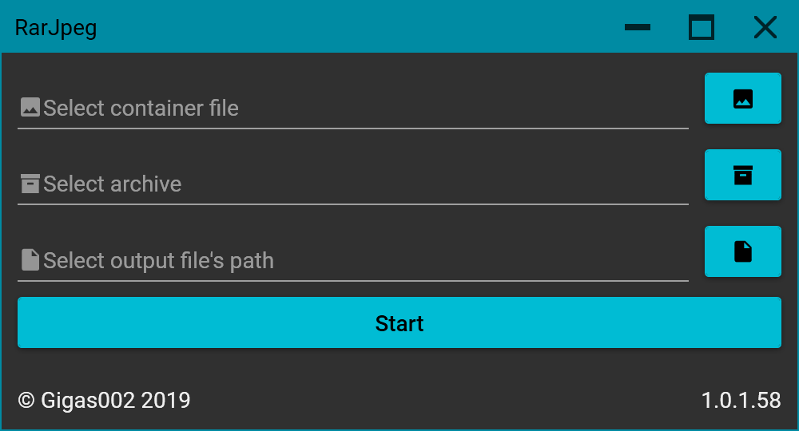

# RarJpeg

Very small and simple project on **WPF** for creating `*.%archiveExtension%.%imageExtension%` files. Solution is build in **VS2019 (16.3.5)**, **.NET Core 3.0**, targeting **Windows** systems. Project can also be built in **VSCode** (**1.39.2**+) with [omnisharp-vscode](https://github.com/OmniSharp/omnisharp-vscode) extension (**1.21.5**+).

I know, that GUI is kind of useless, since you can do it with one line in console: `copy /b image1.jpg+something.rar image2.jpg`, but still I wanted create it. Why not?

## Current version

You can get stable pre-built binaries here: . This project supports [SemVer 2.0.0](https://semver.org/) (template is `{MAJOR}.{MINOR}.{PATCH}.{BUILD}`).

Information about changes since previous releases can be found in [changelog](https://github.com/Gigas002/RarJpeg/blob/master/CHANGELOG.md).

Previous versions can be found on [releases](https://github.com/Gigas002/RarJpeg/releases) and [branches](https://github.com/Gigas002/RarJpeg/branches) pages.

## Requirements

- Windows 7 and newer;

## Usage

Just select **any image as container** and **any archive** as… well, archive. Then, select the **output file’s path** (*don’t write any extensions here please*) and press **Start**.

## Dependencies

- [Caliburn.Micro](<https://www.nuget.org/packages/Caliburn.Micro>) – 4.0.91-alpha (you can get this version on [MyGet](https://www.myget.org/feed/caliburn-micro-builds/package/nuget/Caliburn.Micro));
- [MaterialDesignColors](<https://www.nuget.org/packages/MaterialDesignColors>) – 1.2.0;
- [MaterialDesignThemes](<https://www.nuget.org/packages/MaterialDesignThemes>) – 2.6.0;
- [MaterialDesignExtensions](<https://www.nuget.org/packages/MaterialDesignExtensions/>) – 2.8.0;
- [SharpZipLib](<https://www.nuget.org/packages/SharpZipLib/>) – 1.2.0;
- [System.Threading.Tasks.Extensions](<https://www.nuget.org/packages/System.Threading.Tasks.Extensions>) – 4.5.3;

## Localization

There’s really not much to localize, but feel free to participate! Currently, only **English** and **Russian** are supported. All the localizable strings are located into `Localization/Strings.rexs`.

## Contributing

Even though there’s nothing to do, feel free to contribute, make forks, change some code, add [issues](https://github.com/Gigas002/RarJpeg/issues), etc.
